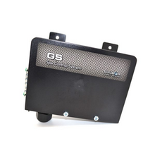
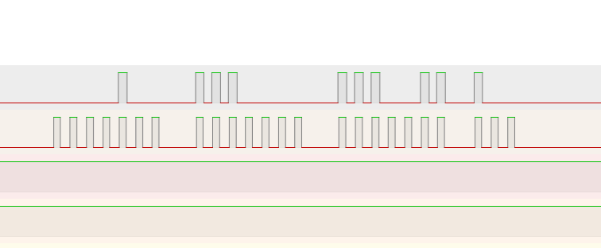
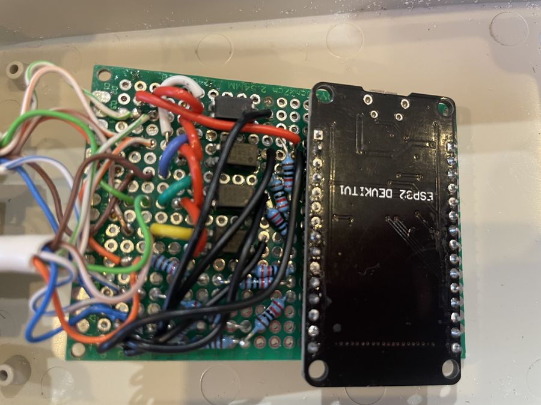

# Balboa-GS100-with-VL260-topside

<p align="center">
  
  
</p>

## Description ⚙️

This project adds an ESP32 to a Balboa GS100 (VL260 topside) to send and receive data using ESPHome and Home Assistant. It provides wiring, measurement notes, and an ESPHome configuration to integrate the spa panel with Home Assistant.

---

## Installation ✅

1. Copy the `esp32-spa.yaml` file and the entire `esp32-spa` folder into your Home Assistant config folder under the `esphome/` subfolder. The folder layout should look like:

```
config/
└── esphome/
    ├── esp32-spa.yaml
    └── esp32-spa/
        ├── __init__.py
        ├── binary_sensor.py
        ├── esp32-spa.h
        └── sensor.py
```

2. In Home Assistant go to **ESPHome**, click **New Device** → **Import From File**, and select `esp32-spa.yaml`.

3. `esp32-spa.yaml` will also look for a `secrets.yaml` file inside the **esphome/** folder for the following keys: `api_key`, `wifi_ssid`, `wifi_password`, `ota_password`, and `ap_password`.

---

## Wiring 🔧

- An attempt was made with an ESP8266, but the Wi‑Fi and ISR requirements (or pin/boot choices) caused persistent boot issues, so the project uses an ESP32 which worked reliably.
- The 4 buttons on the topside panel act like switches that connect to 5V when pressed, but when not pressed show ~2.5V. To avoid interfering with the panel we used optocouplers to reproduce the switch signals safely.
- For the data and clock lines we use a simple voltage divider (2.2k and 4.7k) to reduce the voltage down to ~3.4V, then add a 220Ω series resistor to the ESP32 GPIOs.

Wiring Diagram:


---

## Measurements 📐

- The clock stream consists of 4 packets of data: three packets of 7 bits and a final packet with 3 bits.

- Packet 1 (bits referenced MSB→LSB as 6 5 4 3 2 1 0):
  - Bits 5 and 4 HIGH indicate a `1` in the hundreds digit (Fahrenheit display).
  - Bit 2 is the heater status (when the heater is on this bit pulses).

- Packets 2 & 3: used for the display characters where each bit maps to a segment of the 7-seg style character. Bit mapping (MSB→LSB):

```
Bit -> Segment
6   = top
5   = top-right
4   = bottom-right
3   = bottom
2   = bottom-left
1   = top-left
0   = center
```

- Packet 4 (3 bits):
  - Bit 2 = pump status
  - Bit 1 = light status

 - The remaining bits always appear LOW in my observation. I use them as a frame checksum. They are: Packet 1 bits 6, 3, 1, 0 and Packet 4 bit 0 (MSB to LSB).


- Timing observations (from logic analyzer):
  - Clock pulses: ~16 µs ON with ~21 µs gap between pulses.
  - Data pulses: ~17.5 µs with ~20 µs gap; data is sampled on the rising edges of the clock.
  - Each frame consists of 24 bits (4 packets of 7 bits, 7 bits, 7 bits, and 3 bits.
  - Between each frame is a LOW segment of ~19ms.

Logic analyzer screenshot:



---

## Images📐





---

## Other Balboa projects 🔗

- Balboa-GS510SZ with panel VL700S: https://github.com/MagnusPer/Balboa-GS510SZ
- GL2000 Series: https://github.com/netmindz/balboa_GL_ML_spa_control
- BP Series: https://github.com/ccutrer/balboa_worldwide_app
- GS523SZ: https://github.com/Shuraxxx/-Balboa-GS523SZ-with-panel-VL801D-DeluxeSerie--MQTT


